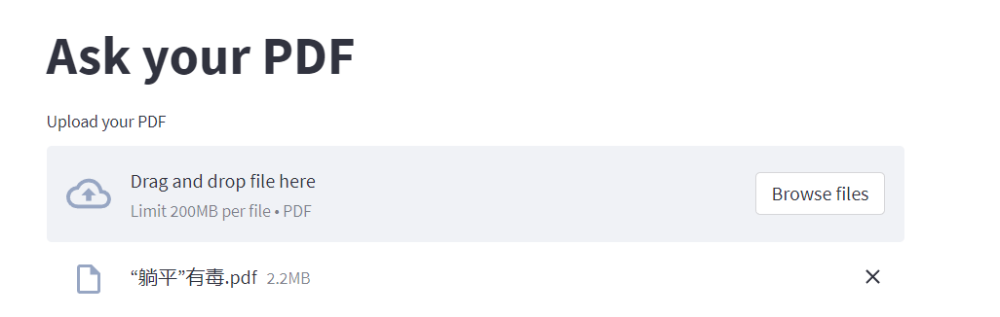
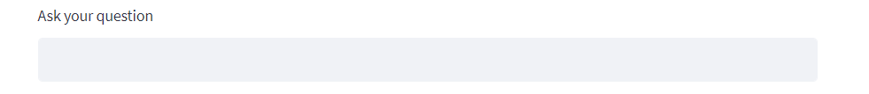

# Reproduce Your Own Chatpdf

Benefits of Privacy: By creating and using your own Chatpdf, you can ensure that your conversations and data are stored and processed locally instead of on external servers. This provides better protection for your privacy and data security, avoiding potential data leaks or misuse.
Expanded Application Scenarios: A reproduced Chatpdf can be customized and optimized according to specific needs. For example, you can apply it in the field of intelligent customer service by training and adjusting the model to adapt to your business scenarios, enabling better understanding and response to customer demands.

# About This Project

**Project Overview:** Introduce the principles and reproduction of Chatpdf, lowering the entry barrier so that more non-NLP or algorithm professionals who are interested can use LLM to create value effortlessly.

**Project Highlights**

- Detailed background and system design introduction to the reproduction process.
- Provide sample code and implementation procedures

**Project Showcase**

After running the code, an automatically generated webpage will open in your browser.

Please note that this webpage is local since I'm poor and can't afford a domain or server:cry::cry::cry: If you have the money, you can create your own webpage.

This section is used for uploading files:

After a successful upload, a text box will appear:

Then, you can ask questions in your chatpdf

**Project Requirements**

- You need to have your own OpenAI API key.
- Use the VS Code editor.
- Basic knowledge of Python is required

# Reproduction Process (Design Process)
[link](Reproduce process.md)
