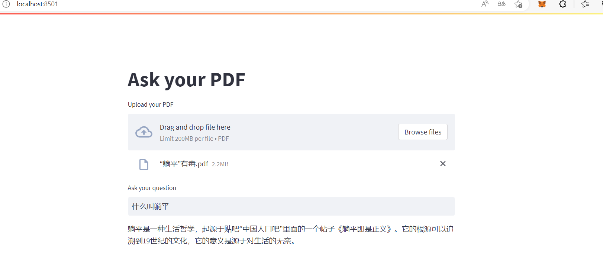

# 复现一个属于自己的chatpdf

1. 隐私性好处：通过创建和使用自己的Chatpdf，您可以确保您的对话和数据在本地存储和处理，而不是在外部服务器上。这样可以更好地保护您的隐私和数据安全，避免潜在的数据泄露或滥用。
2. 拓展应用场景：自己复现的Chatpdf可以根据特定需求进行定制和优化。例如，您可以将其应用于智能客服领域，通过训练和调整模型以适应您的业务场景，使其能更好地理解和回应客户需求。

# 关于这个项目

**项目简介**：介绍 Chatpdf 的原理和复现，降低使用门槛，让更多感兴趣的非NLP或算法专业人士能够无障碍使用LLM创造价值。

**项目亮点**

- 对复现过程有详细的背景和系统设计介绍。
- 提供示例代码和实现流程

**项目展示**

运行代码后会出现自动在你的浏览器上跑出一个网页

注意，这个网页是本地的，因为我穷，买不起域名和服务器:cry::cry::cry:,有条件的同学可以自己做个网页啥的

这个部分是用来上传文件的：

上传成功后会出现一个文本框：

然后你就可以问问题了

**项目要求**

- 需要有自己的openai 的api key
- 使用vscode编译器
- 需要有python基础

# 复现流程（设计过程）
